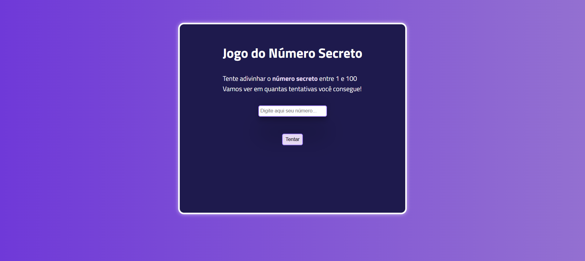
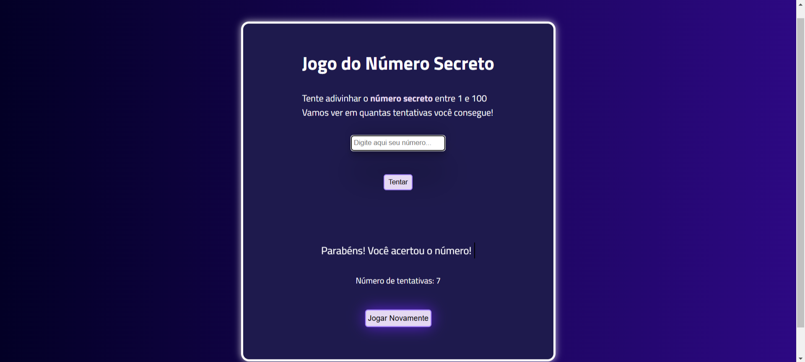

# 🎲 Jogo do Número Secreto
 Um jogo simples e interativo onde o jogador precisa adivinhar um número aleatório entre 1 e 100.

## 📌 Funcionalidades
✅ Geração aleatória de um número secreto  
✅ Feedback interativo para cada tentativa  
✅ Sons ao acertar, errar e clicar nos botões    
✅ Efeito de digitação no feedback  
✅ Design responsivo para todos os dispositivos  
✅ Efeito de pulsação na luz ao ganhar  
✅ Botão para reiniciar o jogo após a vitória  
✅ Fundo gradiente animado

## 🎮 Como jogar?
1️⃣ Digite um número entre 1 e 100 no campo de entrada.  
2️⃣ Clique no botão "Tentar" ou pressione "Enter" para validar sua tentativa.  
3️⃣ Receba um feedback dizendo se o número é maior ou menor.  
4️⃣ Continue tentando até acertar!  
5️⃣ Ao vencer, um efeito de brilho e um som de vitória serão ativados.  
6️⃣ Clique em "Jogar Novamente" para reiniciar o jogo.  

## 📸 Demonstração
  
    
<video <source src="src/video/jogoNumeroSecreto.mp4"/> width="600px"></video>

## 🛠️ Tecnologias Utilizadas
HTML5  
CSS3    
JavaScript   

## 🚀 Como executar o projeto?
1️⃣ Clone este repositório:
`git clone https://github.com/GabriellaCMaciel/Jogo_Numero_Secreto.git`

2️⃣  Abra o arquivo `index.html` no navegador.

## 🔥 Melhorias futuras
 - [ ] Adicionar níveis de dificuldade
 - [ ] Adicionar um cronômetro para tornar o jogo mais desafiador
 - [ ] Criar um ranking de pontuação
## 👩‍💻 Autora
Gabriella C Maciel  
🔗 [LinkedIn](https://www.linkedin.com/in/gabriellacmaciel/)  
🐙 [GitHub](https://github.com/GabriellaCMaciel)  
